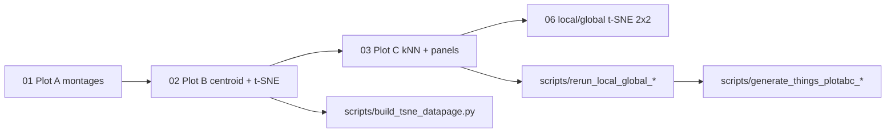

# CCN 2026 — exemplar variability (BabyView)

Analysis code and figures for the **CCN 2026** extended abstract on within-category exemplar variability in infant-view (BabyView) object crops, compared where noted to **THINGS**.

- **Abstract (PDF, local only):** `ccn_2026_abstract.pdf` (not in git)
- **Python:** [`load_things_embeddings.py`](load_things_embeddings.py) (shared module); optional CLIs in [`scripts/`](scripts/)
- **Script catalog:** [`SCRIPTS.md`](SCRIPTS.md) · [`scripts/README.md`](scripts/README.md)
- **Output directories:** [`OUTPUTS.md`](OUTPUTS.md)
- **Related (manuscript, not submitted):** [`../manuscript-2026/not_in_manuscript/exemplar_variability_analyses/`](../manuscript-2026/not_in_manuscript/exemplar_variability_analyses/) — earlier pipeline that informed these plots

Run notebooks with the kernel **current working directory** set to this folder (`analysis/ccn-2026/`).

## Concepts

| Term | Meaning | Primary source |
|------|---------|----------------|
| **Global dispersion** | How spread out exemplars are around the **BV category centroid** (category-level mean distance) | Plot B → `mean_bv_to_bv_centroid` |
| **Local coherence** | Mean distance from each exemplar to its **k** within-category nearest neighbors (lower = tighter local clusters) | Plot C → `mean_knn_distance` (default **k = 5**) |
| **Local/global ratio** | Rank categories by local vs global structure; extremes drive the 2×2 t-SNE panel | Plot C + notebook **06** |

Embeddings: **CLIP** (`clip_embeddings_new`) and **DINOv3** unless a notebook says otherwise.

## Category pools

| Pool | Definition | Typical size |
|------|------------|--------------|
| **Plot A/B/C (BV)** | `data/included_categories.txt` ∩ per-class precision > **0.6** in `annotation/per_class_validation_data.csv` | ~85 categories |
| **Per-exemplar filter** | Rows passing `annotation/per_file_precision_data.csv` (rater validation) | varies |
| **valid85 / valid129** | Manuscript category sets for THINGS↔BV comparisons (`scripts/rerun_local_global_*.py`, etc.) | 85 / 129 |

Exemplar metadata: `annotation/sampled_object_crops_100_bucket_assignments_100ex_8subj_per_video_cap_babyview_only.csv`.

## Notebook pipeline

Run in this order for the main poster figures (**Plots A–C**). Notebooks **04**, **05**, and **06** are supplementary.

| # | Notebook | Role |
|---|----------|------|
| **01** | [`01_plotA_category_montages_low_to_high_variability.ipynb`](01_plotA_category_montages_low_to_high_variability.ipynb) | **Plot A:** Montages along low→high BV variability (25 exemplars); optional THINGS configs use manuscript variability CSVs |
| **02** | [`02_plotB_tsne_distance_to_centroid.ipynb`](02_plotB_tsne_distance_to_centroid.ipynb) | **Plot B:** BV-only distance to BV centroid + per-category t-SNE; writes summary & per-exemplar CSVs |
| **03** | [`03_plotC_knn_diversity.ipynb`](03_plotC_knn_diversity.ipynb) | **Plot C:** Within-category kNN diversity, CLIP vs DINO panels, THINGS comparison section, CCN 2×2 variability figure |
| **04** | [`04_exemplar_inclusion_summary_stats.ipynb`](04_exemplar_inclusion_summary_stats.ipynb) | Supplement: strict filtering counts (all included categories) |
| **05** | [`05_invalid_exemplar_montages_per_category.ipynb`](05_invalid_exemplar_montages_per_category.ipynb) | **Plot E:** Montages of **failed** per-file precision exemplars per category |
| **06** | [`06_make_local_global_extremes_tsne_panel.ipynb`](06_make_local_global_extremes_tsne_panel.ipynb) | 2×2 t-SNE panel for local/global extreme categories (notebook wrapper for script) |

### Optional: `scripts/` (not needed for the poster)

THINGS comparison reruns, vector PDF export, and the HTML datapage live under [`scripts/`](scripts/). See [`scripts/README.md`](scripts/README.md) for which to run and which to skip.

## Key output folders (current)

| Folder | From |
|--------|------|
| [`plotA_category_montages_low_to_high/`](plotA_category_montages_low_to_high/) | 01 |
| [`plotB_tsne_distance_to_centroid_outputs_20260402/`](plotB_tsne_distance_to_centroid_outputs_20260402/) | 02 (preferred; dated run) |
| [`plotC_knn_diversity_outputs/`](plotC_knn_diversity_outputs/) | 03 + scripts |
| [`plotE_invalid_exemplar_montages_per_category/`](plotE_invalid_exemplar_montages_per_category/) | 05 |
| [`plot_things_and_bv_comparisons_outputs/`](plot_things_and_bv_comparisons_outputs/) | `scripts/generate_things_plotabc_and_bv_comparisons.py` |
| [`tsne_datapage/`](tsne_datapage/) | `scripts/build_tsne_datapage.py` (exploratory) |

Older or duplicate runs live under [`old_plots/`](old_plots/) and [`archive/`](archive/). See [OUTPUTS.md](OUTPUTS.md).

## Prerequisites

- Python 3.10+ with: `numpy`, `pandas`, `matplotlib`, `scikit-learn`, `scipy`, `PIL`, `tqdm`
- Repo data: `data/included_categories.txt`, `annotation/*.csv`
- **Cluster paths** for embeddings and crops (set in each notebook’s Parameters cell), e.g.:
  - BV crops: `/data2/dataset/babyview/868_hours/outputs/yoloe_cdi_all_cropped_by_class`
  - BV CLIP: `.../yoloe_cdi_embeddings/clip_embeddings_new`
  - THINGS loaders: [`load_things_embeddings.py`](load_things_embeddings.py) defaults under `/ccn2/dataset/babyview/...`

## Conventions

- **Plot letters (A/B/C)** match the CCN poster layout, not manuscript notebook numbers.
- CSV columns `mean_bv_to_bv_centroid` (Plot B) and `mean_knn_distance` (Plot C) feed local/global extreme tables (`ccn2026_local_global_extreme_categories_*.csv`).
- A frozen executed copy of notebook 03 is kept in [`archive/03_plotC_knn_diversity.executed.ipynb`](archive/03_plotC_knn_diversity.executed.ipynb) (large; do not edit for reruns).

## Git / storage

Large generated assets are listed in the repo [`.gitignore`](../../.gitignore). Source notebooks, `.py` helpers, and this documentation are intended to be versioned; regenerate figures locally after clone.
